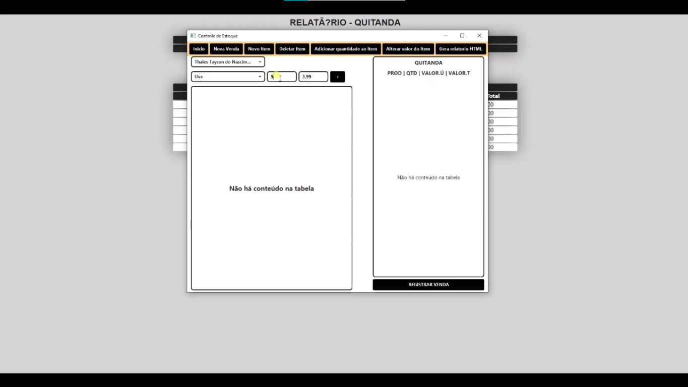

# __Controle de Estoque__

Projeto realizado durante curso de Graduação de TADS pela Faculdade Insted com o objetivo de realizar em grupo um sistema de controle de estoque que gera um relatório html.

## __🛠 Tecnologias__

## __Criadores__

|   Author   |   Author   |   Author   |   Author   |   Author   |
| :-------: | :-------: | :-------: | :-------: | :-------: |
| [ Bárbara Marcheti](https://github.com/Bamarcheti)     | [ Gabriela Espinoza](https://github.com/Espinoza9)     | [ Lucas Almeida](https://github.com/LucasATS)     | [ Matheus Fiigueiredo](https://github.com/MatheusFiigueiredo)     | [ Thales Tayson](https://github.com/ThalesTayson)     |
